# <h1 align="center">**Mildew Detection in Cherry Leaves**</h1>

## Introduction

Mildew detection in cherry leaves is a dashboard app that uses Machine Learning to enable the user to upload images of cherry leaves to determine if the tree is healthy or infected with powedery mildew, and download a report of the findings.

[View the live project here](https://cherry-leaf-mildew-detection.herokuapp.com/)

## Table of Contents

- [Business Requirements](#business-requirements)
- [Hypothesis and how to Validate](#hypothesis-and-how-to-validate)
- [Rationale to map business requirements](#the-rationale-to-map-the-business-requirements-to-the-data-visualisations-and-ml-tasks)
- [ML Business Case](#ml-business-case)
- [Dashboard Design](#dashboard-design---streamlit-app-user-interface)
- [Methodology](#methodology)
- [Project Features](#project-features)
- [Project Outcomes](#project-outcomes)
- [Hypothesis Outcomes](#hypothesis-outcomes)
- [Testing](#testing)
- [Bugs](#bugs)
- [Deployment](#deployment)
- [Languages and Libraries](#languages-and-libraries)
- [Credits](#credits)
 

## Business Requirements

The cherry plantation crop from Farmy & Foods is facing a challenge where their cherry plantations have been presenting powdery mildew, a fungal disease that affects many plant species. The cherry plantation crop is one of the finest products in their portfolio, and the company is concerned about supplying the market with a compromised quality product.

Currently, the process is manual verification to determine if a given cherry tree is infected with powdery mildew. An employee spends around 30 minutes in each tree, taking a few samples of tree leaves and verifying visually if the tree is healthy or has powdery mildew. If there is powdery mildew, the employee applies a specific compound to kill the fungus. The time spent applying this compound is 1 minute. The company has thousands of cherry trees, located on multiple farms across the country. As a result, this manual process is not scalable due to the time spent in the manual inspection process.

To save time in this process, the IT team suggested an ML system that detects instantly, using a leaf tree image, if it is healthy or has powdery mildew. A similar manual process is in place for other crops for detecting pests, and if this initiative is successful, there is a realistic chance to replicate this project for all other crops.

The business case assessment interview can be found [here](readme_files/business_interview.md).

Summary:

- The client is interested in conducting a study to visually differentiate a healthy cherry leaf from one with powdery mildew.
- The client is interested in a dashboard that predicts if a cherry leaf is healthy or contains powdery mildew.
- The client would like the dashboard to predict if a cherry leaf is healthy or contains powdery mildew with a 97% accuracy.

[Table Of Contents](#table-of-contents)

## Hypothesis and how to Validate

1. Cherry leaves with powdery mildew can de differentiated from healthy leaves by their appearance.
   - An average image study will help to determine differences in the appearance of healthy leaves and leaves affected with powdery mildew.
2. Cherry leaves can be determined to be healthy or contain powdery mildew with a degree of 97% accuracy.
   - A model can be trained and validated to achieve a degree of 97% accuracy. The accuracy will be tested using the test set which should also achieve 97% accuracy.

[Table Of Contents](#table-of-contents)

## The rationale to map the business requirements to the Data Visualisations and ML tasks

- Business Requirement 1: Data Visualization

  - The 'mean' and 'standard deviation' images for healthy and powdery mildew infected leaves will be displayed.
  - The difference between an average healthy leaf and an average powdery mildew infected leaf will be displayed.
  - An image montage for both healthy leaves and powdery mildew infected leaves will be displayed.

- Business Requirement 2: Classification

  - To predict if a given leaf is healthy or infected with powdery mildew.
  - The predictions should have a 97% accuracy level.

- Business Requirement 3: Report
  - A report is available and downloadable with the predicted status of all uploaded images.

[Table Of Contents](#table-of-contents)

## ML Business Case

- Create a machine Learning model to predict if a leaf is healthy or infected with powdery mildew, based on an image dataset of historical data containing both healthy and powdery mildew infected leaves. It is a supervised, 2-class, single-label, classification model.
- The model outcome will ideally provide the client with a reliable and faster way to diagnose if a tree is infected with powdery mildew or not.
- The model will be succesfull if an accuracy of at least 97% is obtained on the test set.
- The model output is defined as a flag, indicating if the leaf is infected with powdery mildew or not and the associated probability of being infected or not. The farmers will take a picture of a leaves and upload them to the App.
- Heuristics: The current detection process is manual verification, where an employee spends around 30 minutes in each tree, taking a few samples of tree leaves and verifying visually if the leaf tree is healthy or has powdery mildew. With thousands of trees there is the possibility to produce inaccurate diagnostics due to human errors.
- The dataset contains 4208 images taken from the client's crop fields. The images show healthy cherry leaves and cherry leaves that have powdery mildew.
- The dataset is located on [Kaggle](https://www.kaggle.com/codeinstitute/cherry-leaves).

[Table Of Contents](#table-of-contents)

## Dashboard Design - Streamlit App User Interface

### Page 1: Introduction

- General Information about powdery mildew.
- Details of the project dataset.
- Business requirements.
- Link to this Readme file

### Page 2: Leaf Visualizer

- This page will fulfil business requirement 1.
- Show the difference between the average and variability image.
- Show the difference between average healthy leaves and leaves infected with powdery mildew.
- Show an image montage of healthy leaves and leaves infected with powdery mildew.

### Page 3: Powdery Mildew Detector

- This page will fulfill business requirements 2 and 3 by predicting if a leaf is infected with powdery mildew or not.
- Link to download a set of images showing healthy leaves and leaves infected with powdery mildew for live prediction.
- User Interface with a file uploader widget to allow the user to upload multiple leaf images. It will display the image and a prediction statement, indicating if the leaf is infected with powdery mildew or not and the probability associated with this prediction.
- Report with image name and prediction result.
- Download button to download the report.

### Page 4: Project Hypothesis and Validation

- Detail each [hypothesis](#hypothesis-and-how-to-validate), how it was validated and the conclusion.

### Page 5: ML Performance Metrics

- Details of the model performance including:
  - Label frequencies for train, validation and test sets
  - Model history - accuracy and losses
  - Model evaluation result

[Table Of Contents](#table-of-contents)

## Methodology

### CRISP-DM

CRISP-DM (Cross Industry Standard Process for Data Mining) methodology was used for the data mining project. There are six stages to the process and have the following relationship:

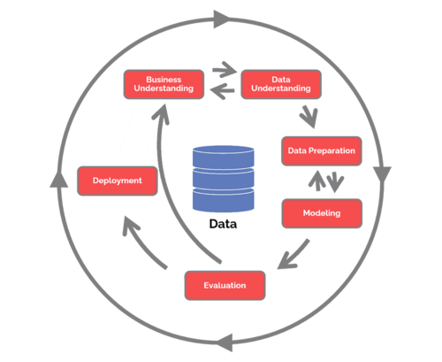

### Agile

An agile approach was implemented for the project using GitHub projects with the aid of Milestones and Issues. Each Issue detailed the relevant tasks to be completed.

The project board can be viewed [here](https://github.com/users/Porsil/projects/7)

[Table Of Contents](#table-of-contents)

## Project Features

Navigation

The navigation bar is visible on all dashboard pages and provides easy links to other pages.

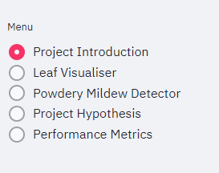

Page 1: Introduction

The introducion page provides the user with information about powdery mildew, the project summary, the dataset and the business requirements. There is also a link to this ReadMe file.

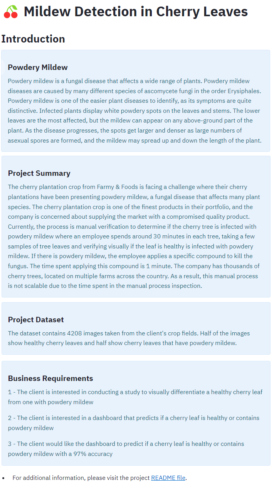

Page 2: Leaf Visualizer

The leaf visualizer page provides the user with the results of the study to visually differentiate a healthy cherry leaf from one with powdery mildew. It was determined that healthy leaves and infected leaves could be distinguished by their appearance.

The page gives the user the options to view the difference between average and variability images, the differences between average infected and average uninfected leaves and an image montage of healthy or infected leaves.

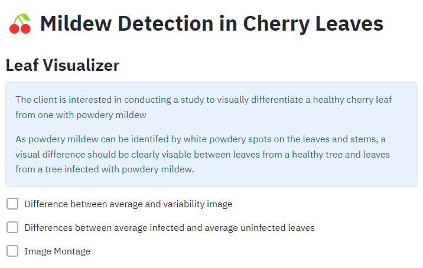

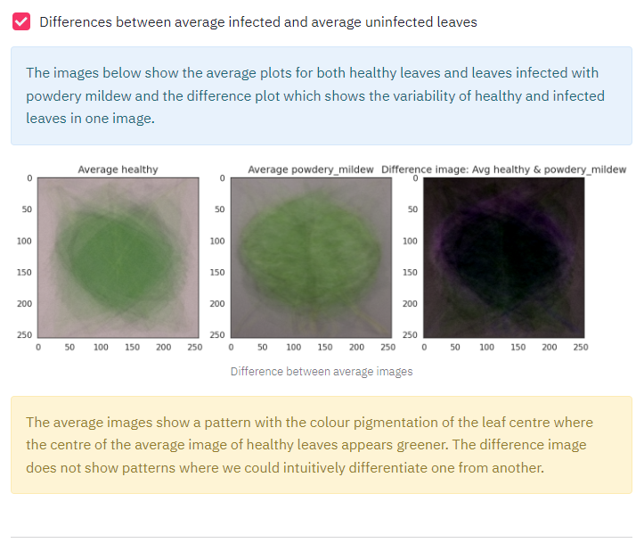
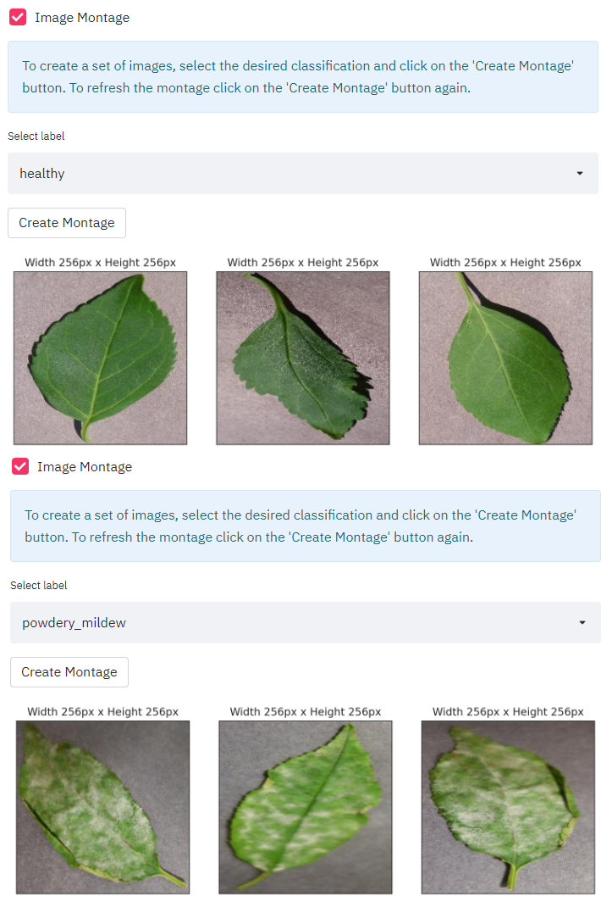

Page 3: Powdery Mildew Detector

The detector page allows the user to upload images of cherry leaves to determine if the leaf is healthy or infected with powdery mildew. Each image is presented with a prediction and a graph depicting the probability of the predictions accuracy. There is then a report detailing the image name, proability accuracy and result. This report is available to download into a .csv file, which can be viewed easily in Microsoft Excel.

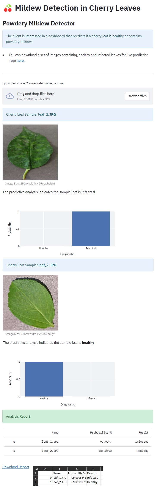

Page 4: Project Hypothesis

The hypothesis page provides the user with details of the project hypotheses and their outcomes.

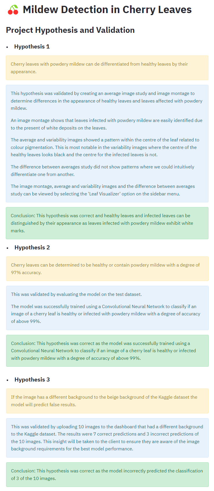

Page 5: Performance Metrics

The performance metrics page provides the user with the Machine Learning model dataset distribution, performance plots and performance on the test dataset.

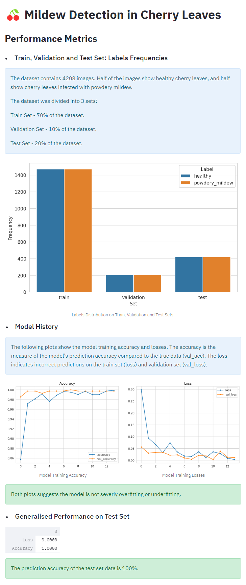

[Table Of Contents](#table-of-contents)

## Project Outcomes

### Business Requirement 1: Data Visualization

The visualization study can be viewed on the [Leaf Visualizer page](https://cherry-leaf-mildew-detection.herokuapp.com/) of the dashboard. The study shows the mean and variability images and an image montage of both healthy and infected leaves. The concludes that healthy leaves and infected leaves can be distinguished by their appearance as leaves infected with powdery mildew exhibit white marks.

### Business Requirement 2: Classification

The classification tool can found on the [Powdery Mildew Detector page](https://cherry-leaf-mildew-detection.herokuapp.com/) of the dashboard. The user is able to upload images of cherry leaves and is given a classification prediction for each image along with a probability graph. The predictions have an accuracy level of above 97%.

### Business Requirement 3: Report

The report can be viewed on the [Powdery Mildew Detector page](https://cherry-leaf-mildew-detection.herokuapp.com/) of the dashboard once images have been classified. The user is presented with a table that shows the image name, probability % and result for each uploaded image. The user can also click 'Download Report' which downloads the report to a .csv file, which can be opened easily in Microsoft Excel.

[Table Of Contents](#table-of-contents)

## Hypothesis Outcomes

### Hypothesis 1

-	Cherry leaves with powdery mildew can de differentiated from healthy leaves by their appearance.

An image montage shows that leaves infected with powdery mildew are easily identified due to the present of white deposits on the infected leaves.
The average and variability images showed a pattern within the center of the leaf related to colour pigmentation. This is most notable in the variability images where the center of the healthy leaves looks black whereas the center for the infected leaves is not.

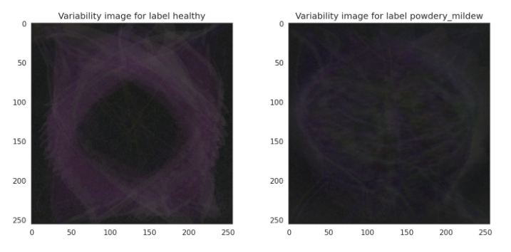

The difference between averages study did not show patterns where we could intuitively differentiate one from another.
The image montage, average and variability images and the difference between averages study can be viewed by selecting the 'Leaf Visualiser' option on the sidebar menu.

Conclusion: Healthy leaves and infected leaves can be distinguished by their appearance as leaves infected with powdery mildew exhibit white marks.

### Hypothesis 2

-	Cherry leaves can be determined to be healthy or contain powdery mildew with a degree of 97% accuracy.

The model accuracy was trained at over 99% with the train and validation datasets, and 100% accuracy was achieved on the test dataset.

Conclusion: The model was successfully trained using a Convolutional Neural Network to classify if an image of a cherry leaf is healthy or infected with powdery mildew with a degree of accuracy of above 99%.

[Table Of Contents](#table-of-contents)

## Testing

ML Model Testing

The model testing can be viewed [here](readme_files/model_testing.pdf).

Dashboard Testing

| Page         | Feature                   | Pass / Fail |
|--------------|:-------------------------:|:-----------:|
| Introduction | Content                   | Pass        |
| Introduction | Nav link                  | Pass        |
| Introduction | ReadMe link               | Pass        |
| Visualizer   | Content                   | Pass        |
| Visualizer   | 1st checkbox ticked       | Pass        |
| Visualizer   | 1st checkbox unticked     | Pass        |
| Visualizer   | 2nd checkboz ticked       | Pass        |
| Visualizer   | 2nd checkbox unticked     | Pass        |
| Visualizer   | 3rd checkbox ticked       | Pass        |
| Visualizer   | 3rd checkbox unticked     | Pass        |
| Visualizer   | Healthy montage           | Pass        |
| Visualiser   | Infected montage          | Pass        |
| Detector     | Content                   | Pass        |
| Detector     | Kaggle link               | Pass        |
| Detector     | Drag add drop file upload | Pass        |
| Detector     | Browse file upload        | Pass        |
| Detector     | Show uploaded images      | Pass        |
| Detector     | Show predictions          | Pass        |
| Detector     | Show probability graph    | Pass        |
| Detector     | Analysis report           | Pass        |
| Detector     | Downloadable report       | Pass        |
| Hypothesis   | Content                   | Pass        |
| Performance  | Content                   | Pass        |

[Table Of Contents](#table-of-contents)

## Bugs

### Fixed Bugs

CodeAnywhere

Several issues were encountered with the CodeAnywhere IDE.

Firstly, the IDE would often go offline for 2 to 3 seconds. For the most part this was not an issue but if this occurred whilst executing a cell in a Jupyter notebook the IDE would crash and require restarting. This meant it was particularly difficult to fit the model as successfully executing this process often took up to an hour. As such not as many models were trained as I would have hoped. I decided to stop after v5 and ensure my dashboard and ReadMe report were complete to ensure my project was submitted on time. This issue also meant that early stopped was added to each model, as running all 25 epochs would take several hours and have a high risk of disconnection. This in turn meant that it was harder to detect if the model was overfitting.

Secondly, during the model training impacted by the first issue, often the code that was saved and committed did not match the code what was in the workspace. Autosave was enabled and all code double checked to be saved by selecting File>Save All before the ‘git add’ and ‘git commit’ commands. This is shown in the commit for v4 where the code in Jupyter notebook 03_modelling_and_evaluation shows an error message for fitting the model, if this was true the outputs for the model would not have been generated.

Thirdly, when trying to commit the code for v3, the workspace would crash. Once re-opened the ‘git add’ command would produce the following error:

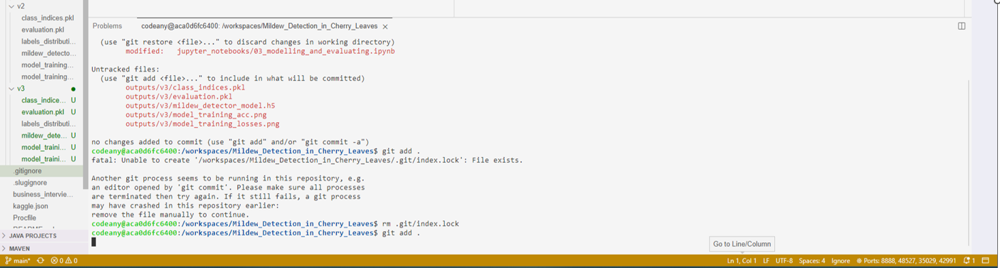

This was fixed by running the command ‘rm -f .git/index.lock’ as per this [Stack Overflow post](https://stackoverflow.com/questions/38004148/another-git-process-seems-to-be-running-in-this-repository). The issue kept occurring so instead of using ‘git add .’ each file was added individually. This determined that the source of the error was the ‘mildew_detector_model.h5’. To fix the error this file was added to the .gitignore file. The same was done for v2-5, and only v5 was removed to complete the dashboard.

### Unfixed Bugs

There are no known unfixed bugs.

[Table Of Contents](#table-of-contents)

## Deployment

### Heroku

To deploy this app to Heroku from its GitHub repository:

#### Create a Heroku App:
- Log in to [Heroku](https://dashboard.heroku.com/apps). If required, create an account.
- Click the 'New' button in the top right and select 'Create new app' from the drop-down menu.
- Enter a name for the app in the 'App name' field, this must be an unique and should be meaningful to the app's content.
- Select your region in the 'Choose a region' field.
- Click on the 'Create app' button.

#### Deploy in Heroku
- Ensure requirements.txt file exists and contains the dependancies.
- Set the stack to Heroku-20 as follows:
    - In Heroku, click 'Account Settings' from the avatar menu.
    - Scroll to the 'API Key' section and click 'Reveal' then copy the key.
    - In the workspace, Log in to the Heroku command line interface using 'heroku login -i'.
    - Enter your email and copied API when prompted.
    - Use the command 'heroku stack:set heroku-20 -a yourappname'. yourappname is the name given to the app in the 'Create a Heroku App' section above.
- Ensure the runtime.txt Python version to a [Heroku-20](https://devcenter.heroku.com/articles/python-support#supported-runtimes) stack currently supported version.
- Ensure a Procfile is present and contains the code 'web: sh setup.sh && streamlit run app.py'.
- Ensure the code is committed and pushed to GitHub.
- In Heroku click on the 'Deploy' tab and scroll down to the 'Deployment Method' section. Select 'GitHub' and confirm you wish to deploy using GitHub. Enter your GitHub password if prompted.
- Scroll to the 'Connect to GitHub' section and search for your repository.
- Click 'Connect' when found.
- To deploy go to the 'Manual Deploy' section add the 'main' branch to 'Choose a branch to deploy' field and click 'Deploy Branch'.
- The app is now live, click 'View' to view the deployed site.

### Forking the repository
- Open the [Mildew Detection in Cherry Leaves](https://github.com/Porsil/mildew_detection_in_cherry_leaves) repository.
- Click the 'Fork' button in the top right.
- This creates a copy of the repository.

### Cloning the repository
- Open the [Mildew Detection in Cherry Leaves](https://github.com/Porsil/mildew_detection_in_cherry_leaves) repository.
- Click the green '<> Code' button. Select the preferred cloning option from the list then copy the link provided.
- Change the current working directory to the location where you want the cloned directory.
- Type 'git clone' and paste the URL you copied earlier.
- Press 'Enter' to create your local clone.

[Table Of Contents](#table-of-contents)

## Languages and Libraries

### Languages Used

- Python

### Frameworks, Libraries & Programs Used

- [GitHub](https://github.com/) was used for version control and agile methodology.
- [CodeAnywhere](https://codeanywhere.com/) was the workspace used for the project.
- [Kaggle](https://www.kaggle.com/) was the source of the dataset.
- [Jupyter Notebook](https://jupyter.org/) was used to run the machine learning pipeline.
- [Joblib](https://joblib.readthedocs.io/en/latest/) for saving and loading image shape.
- [NumPy](https://numpy.org/) was used to convert images into an array.
- [Pandas](https://pandas.pydata.org/) was used for data analysis and manipulation.
- [Matplotlib](https://matplotlib.org/) was used to create charts and plots.
- [Seaborn](https://seaborn.pydata.org/) was used for data visualization.
- [Plotly](https://plotly.com/) was used to create charts and plots.
- [Streamlit](https://streamlit.io/) was used to create the dashboard.
- [Scikit-learn](https://scikit-learn.org/stable/) was used as a machine learning library.
- [Tensorflow](https://www.tensorflow.org/) was used as a machine learning library.
- [Keras](https://keras.io/) was used as a machine learning library.
- [Heroku](https://dashboard.heroku.com/login) was used to deploy the site.

[Table Of Contents](#table-of-contents)

## Credits

- Code Instiute [Malaria Detector](https://github.com/Code-Institute-Solutions/WalkthroughProject01) project was used extensively as a reference when creating this project.
- Code Institue [Mildew Detection in Cherry Leaves](https://github.com/Code-Institute-Solutions/milestone-project-mildew-detection-in-cherry-leaves) template was used to create the project.
- This [StackOverflow](https://stackoverflow.com/questions/38004148/another-git-process-seems-to-be-running-in-this-repository) post was used to fix the git add bug.
- Details of powdery mildew were taken from this [Wikipedia](https://en.wikipedia.org/wiki/Powdery_mildew) article.

[Table Of Contents](#table-of-contents)